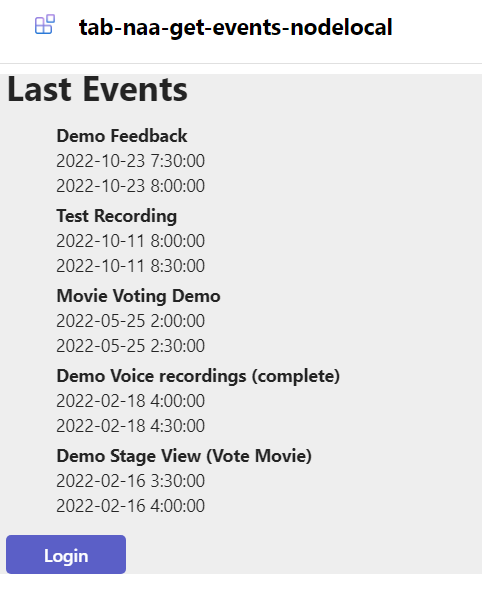

# Tab NAA GET EVENTS

## Summary

This app describes how to establish a Teams Tab Nested app authentication. 




For further details see the author's [blog post](https://mmsharepoint.wordpress.com/2024/).


## Tools and Frameworks


## Applies to

This sample was created [using the Teams Toolkit with Visual Studio Code](https://learn.microsoft.com/en-us/microsoftteams/platform/toolkit/teams-toolkit-fundamentals?pivots=visual-studio&WT.mc_id=M365-MVP-5004617). The same sample will also realized with the [Teams Toolkit for Visual Studio 2022](https://learn.microsoft.com/en-us/microsoftteams/platform/toolkit/toolkit-v4/teams-toolkit-fundamentals-vs?WT.mc_id=M365-MVP-5004617) and can be found ...

## Version history

Version|Date|Author|Comments
-------|----|----|--------
1.0|Sep 30, 2024|[Markus Moeller](https://twitter.com/moeller2_0)|Initial release

## Disclaimer

**THIS CODE IS PROVIDED *AS IS* WITHOUT WARRANTY OF ANY KIND, EITHER EXPRESS OR IMPLIED, INCLUDING ANY IMPLIED WARRANTIES OF FITNESS FOR A PARTICULAR PURPOSE, MERCHANTABILITY, OR NON-INFRINGEMENT.**

## Minimal Path to Awesome
- Clone the repository
    ```bash
    git clone https://github.com/mmsharepoint/tab-sso-graph-spo-refresh-node>.git
    ```

- In Teams Toolkit:
1. First, select the Teams Toolkit icon on the left in the VS Code toolbar.
2. In the Account section, sign in with your [Microsoft 365 account](https://docs.microsoft.com/microsoftteams/platform/toolkit/accounts) if you haven't already.
3. Press F5 to start debugging which launches your app in Teams using a web browser. Select `Debug in Teams (Edge)` or `Debug in Teams (Chrome)`.
4. When Teams launches in the browser, select the Add button in the dialog to install your app to a Team of your choice
5. Confirm the Configuration screen with 
6. Ensure the permissions of your Entra ID app are consented tenant-wide
  
## Features
- [Nested app authentication](https://learn.microsoft.com/en-us/microsoftteams/platform/concepts/authentication/nested-authentication?tabs=js&WT.mc_id=M365-MVP-5004617)
- [Query latest event via Microsoft Graph and OAuth](https://learn.microsoft.com/en-us/graph/query-parameters?view=graph-rest-1.0&tabs=http&WT.mc_id=M365-MVP-5004617)